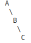
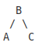
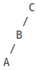
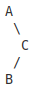
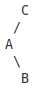

# Overview

AVL Trees are a type of Binary Search Tree which can rebalance itself to ensure an even distribution of values between its left and right subtrees. Because AVL trees can rebalance themselves, all traversal functions are guaranteed to run in logarithmic time.

# How does it work?

Along with the value and a left and right child, each tree node also has a balance factor. The balance factor is the difference in height between the node's left and right children. If the difference is greater than 1, nodes are rotated to rebalance it. There are 4 types of rotations depending on how the unbalanced nodes are arranged.

## Left Rotation

In this tree, A's balance factor is 2 because it has a right child height 2 and left child height 0. B's balance factor is 1 because it's right child height is 1 and its left child height is 0. To rebalance this tree, AVL will rotate the nodes left so that B becomes the parent node, A becomes its left child and C remains its right child.

## Right Rotation

In this tree, C's balance factor is -2 because it has a left child height 2 and right child height 0. B's balance factor is -1 because it's left child height is 1 and its right child height is 0. To rebalance this tree, AVL will rotate the nodes right so that B becomes the parent node, A becomes its left child and C remains its right child.

## Right-Left Rotation

In this tree, A's balance factor is 2 because it has a right child height 2 and left child height 0. C's balance factor is -1 because it's left child height is 1 and its right child height is 0. To rebalance this tree, AVL will first rotate B and C to the right. Then it will rotate all three nodes to the left.

 right rotation

 left rotation

## Left-Right Rotation

In this tree, C's balance factor is -2 because it has a left child height 2 and right child height 0. A's balance factor is 1 because it's right child height is 1 and its left child height is 0. To rebalance this tree, AVL will first rotate A and B to the left. Then it will rotate all three nodes to the right.

 left rotation

 right rotation

# Big O Stats

|            | Worst Case | Average Case | Best Case |
|------------|------------|--------------|-----------|
| Insert     | O(log n)   | O(log n)     |  O(log n) |
| Delete     | O(log n)   | O(log n)     |  O(log n) |
| Search     | O(log n)   | O(log n)     |  O(log n) |

